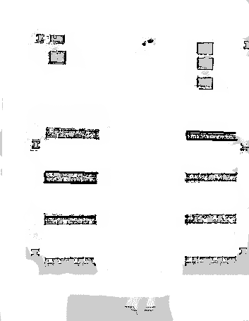

# 🤖 Semantic Navigation

**📺 [Full Proje Videosu - YouTube](https://www.youtube.com/watch?v=GTgXBogI1WY)**

YOLOv8 nesne tespiti ve semantik haritalama kullanarak otonom navigasyon yapabilen ROS 2 robot sistemi. Robot, çevresindeki nesneleri tespit eder, konumlarını haritaya kaydeder ve kullanıcı komutlarıyla bu nesnelere otonom olarak gider.

## 📹 Demo

### Base to Person
<video width="100%" controls>
  <source src="readme/base_to_person.mp4" type="video/mp4">
  Tarayıcınız video oynatmayı desteklemiyor.
</video>

### Person to Base
<video width="100%" controls>
  <source src="readme/person_to_base.mp4" type="video/mp4">
  Tarayıcınız video oynatmayı desteklemiyor.
</video> 

## 🗺️ SLAM Haritası



## 🛠️ Teknolojiler


## 📦 Kurulum

```bash
# Workspace'i hazırla
cd ~/Desktop/robot_ws
source /opt/ros/humble/setup.bash

# Bağımlılıkları kur
sudo apt install -y \
    ros-humble-nav2-bringup \
    ros-humble-slam-toolbox \
    ros-humble-robot-localization \
    ros-humble-ros-gz-sim \
    ros-humble-cv-bridge \
    python3-ultralytics \
    python3-numpy \
    python3-opencv

# Projeyi derle
colcon build --symlink-install
source install/setup.bash
```

## 🚀 Kullanım

### 1. Robot Simülasyonunu Başlat
```bash
ros2 launch robot_description spawn_robot.launch.py
```

### 2. SLAM ile Harita Oluştur
```bash
ros2 launch robot_description slam.launch.py
```
Robotu manuel hareket ettirerek haritayı oluşturun (Haritayı oluşturmadan önce semantik_mapper çalıştırmayı unutmayın.).

### 3. Semantik Haritalama
```bash
ros2 run semantic_nav semantic_mapper
```
- YOLOv8 ile nesneleri tespit eder
- Konumları `semantic_db.json`'a kaydeder
- RViz'de marker olarak gösterir
- **Nesne ne kadar fazla görülürse, marker yeşile döner (daha kesin konum)**

### 4. Navigasyon Modu
```bash
ros2 launch robot_description navigation.launch.py
```

### 5. Nesneye Git
```bash
ros2 run semantic_nav semantic_nav_command
```
Terminalden nesne adı girerek robotun o nesneye otonom gitmesini sağlar:
```
Gitmek istediğiniz nesne (Çıkış için 'q'): person
🚀 person hedefine gidiliyor...
```

## 📁 Proje Yapısı

```
src/
├── robot_description/    # Robot tanımları, launch dosyaları, haritalar
└── semantic_nav/         # YOLO tespiti, semantik haritalama, navigasyon
    ├── semantic_nav/     # Python modülleri
    ├── models/           # YOLOv8 modeli
    └── db/               # semantic_db.json (nesne konumları)
```

## ✨ Özellikler

- 🎯 YOLOv8 ile gerçek zamanlı nesne tespiti
- 🗺️ Dinamik semantik haritalama (nesne ne kadar görülürse o kadar kesin)
- 🧭 Nav2 ile otonom navigasyon
- 📍 SLAM Toolbox ile harita oluşturma - rtab-map opsiyonel (3D)
- 🎮 Gazebo simülasyonu

## 👤 Geliştirici

**berkantastan** - btastan9@gmail.com


